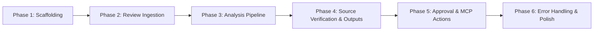

> [!IMPORTANT]
> **AUTONOMOUS ARCHITECTURE UPDATE**
> This project has been updated to run autonomously. 
> - The 5-step interactive frontend wizard has been replaced by a **React Dashboard**.
> - The backend uses **APScheduler** to automatically trigger the review fetch and LangGraph analysis pipeline every day at 11:00 AM UTC.
> - The MCP Approval Gate remains the only manual step, which is actioned from the new Frontend Dashboard.
>
> *(Note: The original documentation below describes the manual 5-step UI, which is now superseded by the autonomous dashboard model.)*

# Groww AI Product Feedback Intelligence — Phase-Wise Implementation Plan

Build a full-stack internal web application that ingests real Google Play reviews for the Groww Android app, runs an AI-powered analysis pipeline (LangChain + LangGraph + Groq), and produces a Weekly Product Pulse and Customer Fee Explainer behind an explicit approval gate — then executes MCP write actions (internal document append + Gmail draft creation).

---

## Phase 1 — Project Scaffolding & Core Infrastructure

**Goal**: Set up the monorepo, install all dependencies, configure environment loading, and establish the database layer so every subsequent phase has a runnable skeleton.

---

### Backend Foundation

#### [NEW] `backend/requirements.txt`
All Python dependencies as specified in [architecture.md §15.1](file:///Users/saurabhsharma/Documents/Product%20Insights%20Copilot%20Groww/architecture.md#L1329-L1362):
- `fastapi`, `uvicorn[standard]`, `pydantic`, `pydantic-settings`
- `langchain`, `langchain-core`, `langchain-groq`, `langgraph`
- `google-play-scraper`, `httpx`, `beautifulsoup4`
- `google-api-python-client`, `google-auth-httplib2`, `google-auth-oauthlib`
- `aiosqlite`, `python-dotenv`, `python-multipart`

#### [NEW] `backend/core/config.py`
Pydantic `BaseSettings` model loading from `.env` — app name, package ID, lookback weeks, Groq key/model/temperature, Google OAuth credentials, database URL. ([architecture.md §3](file:///Users/saurabhsharma/Documents/Product%20Insights%20Copilot%20Groww/architecture.md#L89-L150))

#### [NEW] `backend/core/database.py`
- Async SQLite connection via `aiosqlite`.
- `init_db()` function that runs all `CREATE TABLE` statements from [architecture.md §7.1](file:///Users/saurabhsharma/Documents/Product%20Insights%20Copilot%20Groww/architecture.md#L682-L764) — `reviews`, `themes`, `fee_issues`, `official_sources`, `analysis_runs`.
- Session management helpers.

#### [NEW] `backend/main.py`
FastAPI entry point:
- CORS middleware (allow frontend origin `:5173`).
- Call `init_db()` on startup.
- Include all API routers (stubbed initially).

#### [NEW] `.env.example`
Template with all required variables documented.

---

### Frontend Foundation

#### [NEW] `frontend/package.json`
Dependencies: `react`, `react-dom`, `zustand`, `axios`, `lucide-react`, `clsx`.
Dev deps: `typescript`, `vite`, `@vitejs/plugin-react`, `tailwindcss`, `postcss`, `autoprefixer`, `@types/react`, `@types/react-dom`. ([architecture.md §15.2](file:///Users/saurabhsharma/Documents/Product%20Insights%20Copilot%20Groww/architecture.md#L1364-L1387))

#### [NEW] `frontend/vite.config.ts`
Vite config with React plugin and API proxy to `localhost:8000`.

#### [NEW] `frontend/tailwind.config.js` + `frontend/postcss.config.js`
Tailwind CSS setup with content paths and custom design tokens.

#### [NEW] `frontend/src/styles/index.css`
Tailwind directives + Groww-inspired design tokens (dark green primary, professional palette).

#### [NEW] `frontend/src/main.tsx` + `frontend/src/App.tsx`
React entry point and root component with placeholder routing shell.

---

### Pydantic Data Models

#### [NEW] `backend/models/review.py`
`ReviewRecord` model — review_id, review_text, rating, review_date, app_version, developer_reply, source, source_url, classification fields (primary_theme, secondary_theme, sentiment, severity, issue_type). ([architecture.md §7.2](file:///Users/saurabhsharma/Documents/Product%20Insights%20Copilot%20Groww/architecture.md#L769-L789))

#### [NEW] `backend/models/theme.py`
`Theme` model — theme_name, description, review_count, percentage, negative_count, avg_rating, representative_review_ids, trend, rank_score.

#### [NEW] `backend/models/fee_issue.py`
`FeeIssue` + `OfficialSource` models.

#### [NEW] `backend/models/outputs.py`
`CustomerQuote`, `ProductPulse`, `FeeExplainer` models.

#### [NEW] `backend/models/approval.py`
`ApprovalStatus` enum, `MCPActionResult` model.

---

### Verification

- `uvicorn main:app --reload` starts without errors on `:8000`.
- `npm run dev` starts Vite on `:5173` and renders the shell.
- `GET /api/config` returns app name, package, lookback weeks.
- SQLite database auto-creates with all tables.

---

## Phase 2 — Review Ingestion Pipeline

**Goal**: Fetch real Google Play reviews for `com.nextbillion.groww`, clean/normalize them, persist to SQLite, and expose them via API — with the first frontend screen fully wired.

---

### Backend — Review Scraper Service

#### [NEW] `backend/services/review_scraper.py`
- Abstract `ReviewProvider` interface with `get_reviews(app_id, start_date, end_date)`.
- `GooglePlayScraperProvider` implementation using `google-play-scraper`:
  - Pagination via `continuation_token`.
  - 7-day rolling window calculation.
  - Deduplication by `review_id`.
  - Normalization to `ReviewRecord`.
  - Run sync scraper in `asyncio.to_thread()`.

([architecture.md §6](file:///Users/saurabhsharma/Documents/Product%20Insights%20Copilot%20Groww/architecture.md#L551-L676), [problemStatement.md §4](file:///Users/saurabhsharma/Documents/Product%20Insights%20Copilot%20Groww/problemStatement.md#L99-L144))

#### [NEW] `backend/services/review_cleaner.py`
- Remove empty/whitespace-only reviews.
- Remove exact text duplicates.
- Normalize whitespace.
- Exclude reviews outside the 7-day window.
- Return cleaning stats: `{ removed_empty, removed_duplicates, total_valid }`.

([problemStatement.md §11](file:///Users/saurabhsharma/Documents/Product%20Insights%20Copilot%20Groww/problemStatement.md#L343-L357))

### Backend — Reviews API

#### [NEW] `backend/api/reviews.py`
| Endpoint | Purpose |
|---|---|
| `POST /api/reviews/fetch` | Trigger review fetch, return `batch_id` + stats |
| `GET /api/reviews/status/{batch_id}` | Poll fetch progress |
| `GET /api/reviews/{batch_id}` | Return fetched reviews for a batch |

- Create `analysis_runs` row on fetch start.
- Persist cleaned reviews to `reviews` table with `batch_id`.
- Return: review count, period start/end, average rating.

### Frontend — Screen 1: Source & Review Fetch

#### [NEW] `frontend/src/components/screens/SourceFetch.tsx`
- App info card: Source (Google Play Store), Application (Groww Android App), Review Window (Last 7 Days).
- "Fetch Latest Reviews" primary CTA button.
- Post-fetch statistics card: reviews retrieved, period, average rating.
- Status checklist with animated checkmarks: ✓ Source connected → ✓ Reviews retrieved → ✓ Review period validated.

#### [NEW] `frontend/src/types/index.ts`
TypeScript interfaces mirroring all backend Pydantic models.

#### [NEW] `frontend/src/api/client.ts`
Axios instance with base URL and typed API call functions.

#### [NEW] `frontend/src/store/workflowStore.ts`
Zustand store — initial structure with `currentStep`, `batchId`, `fetchStatus`, `reviewCount`, `reviewPeriod`, `avgRating`. ([architecture.md §11.1](file:///Users/saurabhsharma/Documents/Product%20Insights%20Copilot%20Groww/architecture.md#L1147-L1200))

#### [NEW] `frontend/src/components/layout/Header.tsx`
App header: "Groww Product Feedback Intelligence".

#### [NEW] `frontend/src/components/layout/StepIndicator.tsx`
5-step workflow progress bar: Fetch → Analyze → Insights → Output → Approve.

#### [NEW] `frontend/src/components/common/Card.tsx`, `Badge.tsx`, `StatusIndicator.tsx`
Reusable UI primitives.

### Verification

- Click "Fetch Latest Reviews" → real reviews from Google Play appear.
- Statistics card shows actual count, date range, avg rating.
- Reviews are persisted in SQLite `reviews` table.
- Cleaning stats show removed empties/duplicates.

---

## Phase 3 — LangGraph Analysis Pipeline (Nodes 1–6)

**Goal**: Build the LangChain/LangGraph orchestration layer — from review classification through trend analysis — with SSE progress streaming to a live Analysis Progress screen.

---

### Backend — LLM & Agent Foundation

#### [NEW] `backend/agents/llm.py`
- `get_llm()` factory for `ChatGroq`.
- `analysis_llm` (temperature=0.0) and `generation_llm` (temperature=0.3) shared instances.

([architecture.md §5.2](file:///Users/saurabhsharma/Documents/Product%20Insights%20Copilot%20Groww/architecture.md#L294-L314))

#### [NEW] `backend/agents/state.py`
`PipelineState` TypedDict — all fields as defined in [architecture.md §5.3](file:///Users/saurabhsharma/Documents/Product%20Insights%20Copilot%20Groww/architecture.md#L316-L364).

### Backend — LangGraph Nodes (Analysis Phase)

#### [NEW] `backend/agents/prompts/classify.py`
Prompt template for per-review classification: assign primary_theme, secondary_theme, sentiment, severity, issue_type. ([problemStatement.md §14](file:///Users/saurabhsharma/Documents/Product%20Insights%20Copilot%20Groww/problemStatement.md#L406-L437))

#### [NEW] `backend/agents/nodes/classify_reviews.py`
- Batch reviews for LLM (chunk if >50 reviews per call).
- Parse structured JSON output.
- Update `classified_reviews` in state.

#### [NEW] `backend/agents/prompts/cluster.py`
Prompt for emergent theme clustering (≤5 themes, NOT hard-coded). ([problemStatement.md §13](file:///Users/saurabhsharma/Documents/Product%20Insights%20Copilot%20Groww/problemStatement.md#L382-L403))

#### [NEW] `backend/agents/nodes/cluster_themes.py`
- Group classified reviews into ≤5 themes.
- Build `Theme` objects with review_count, percentage, negative_count, avg_rating.

([architecture.md §5.6](file:///Users/saurabhsharma/Documents/Product%20Insights%20Copilot%20Groww/architecture.md#L493-L547))

#### [NEW] `backend/agents/nodes/rank_themes.py`
- Composite scoring formula:
  ```
  Score = 0.30×Frequency + 0.25×Negativity + 0.20×Severity + 0.15×Recency + 0.10×Persistence
  ```
- Select top 3 (or fewer if insufficient evidence).

([architecture.md §12](file:///Users/saurabhsharma/Documents/Product%20Insights%20Copilot%20Groww/architecture.md#L1250-L1271), [problemStatement.md §16](file:///Users/saurabhsharma/Documents/Product%20Insights%20Copilot%20Groww/problemStatement.md#L457-L474))

#### [NEW] `backend/agents/prompts/fee_detection.py`
Prompt for scanning reviews for recurring fee/charge confusion patterns. ([problemStatement.md §19–20](file:///Users/saurabhsharma/Documents/Product%20Insights%20Copilot%20Groww/problemStatement.md#L525-L583))

#### [NEW] `backend/agents/nodes/detect_fee.py`
- Scan for "Why was I charged?", "What is this fee?", etc.
- Group into candidate fee issues.
- Select strongest recurring issue with confidence level.
- **Must not** pre-assume a specific fee — emerge from data.

#### [NEW] `backend/agents/nodes/extract_quotes.py`
- Select exactly 3 real, verbatim customer quotes.
- Quotes fetched from the original corpus, never LLM-generated.
- Maintain provenance: review_id, quote, date, rating, theme, source.

([problemStatement.md §18](file:///Users/saurabhsharma/Documents/Product%20Insights%20Copilot%20Groww/problemStatement.md#L498-L522))

#### [NEW] `backend/agents/nodes/analyze_trends.py`
- Statistical temporal analysis across 7-day window.
- Per-theme trend: Increasing / Decreasing / Stable / Spiking.
- Only state trends supported by actual data.

([problemStatement.md §17](file:///Users/saurabhsharma/Documents/Product%20Insights%20Copilot%20Groww/problemStatement.md#L477-L494))

### Backend — Analysis API with SSE

#### [NEW] `backend/api/analysis.py`
| Endpoint | Purpose |
|---|---|
| `POST /api/analysis/run/{batch_id}` | Trigger the LangGraph pipeline |
| `GET /api/analysis/stream/{batch_id}` | SSE stream for real-time progress |
| `GET /api/analysis/results/{batch_id}` | Get complete analysis results |

- SSE events: `{ step, status, message }` per pipeline node.
- Persist themes, fee_issues to SQLite on completion.

([architecture.md §8.2](file:///Users/saurabhsharma/Documents/Product%20Insights%20Copilot%20Groww/architecture.md#L885-L913))

### Backend — Partial Graph Assembly

#### [NEW] `backend/agents/graph.py`
LangGraph `StateGraph` with nodes: `classify_reviews` → `cluster_themes` → `rank_themes` → `detect_fee_confusion` → `extract_quotes` → `analyze_trends`. Conditional edge after `analyze_trends` for source verification. ([architecture.md §5.4](file:///Users/saurabhsharma/Documents/Product%20Insights%20Copilot%20Groww/architecture.md#L366-L425))

### Frontend — Screen 2: Analysis Progress

#### [NEW] `frontend/src/components/screens/AnalysisProgress.tsx`
- SSE listener consuming `/api/analysis/stream/{batch_id}`.
- Animated pipeline step checklist:
  - ✓ Reviews loaded → ✓ Reviews cleaned → ✓ Themes identified → ✓ Themes ranked → ✓ Fee confusion detected → ✓ Official sources verified → ✓ Product Pulse generated → ✓ Fee Explainer generated
- Current step highlighted with spinner.
- Auto-advance to Screen 3 on completion.

#### [NEW] `frontend/src/components/common/ProgressStep.tsx`
Reusable step item: icon (pending/active/done/error), label, description.

### Verification

- `POST /api/analysis/run/{batch_id}` → SSE stream emits step events.
- All 6 nodes run without errors on real review data.
- Themes, fee_issue, quotes, trends are computed and persisted.
- Frontend shows animated progress for each step.

---

## Phase 4 — Source Verification & Output Generation (Nodes 7–9)

**Goal**: Complete the LangGraph pipeline — official Groww source verification, Weekly Product Pulse generation, and Fee Explainer generation — with the Insights Dashboard and Generated Outputs screens.

---

### Backend — Source Verification

#### [NEW] `backend/services/source_retriever.py`
- `OfficialSourceRetriever` class.
- Allowed domains: `groww.in`, `support.groww.in`, `help.groww.in`.
- `search_fee_documentation(fee_name)`:
  - Construct search URLs targeting official Groww domains.
  - Fetch page content via `httpx`.
  - Parse with BeautifulSoup, extract main content.
  - Use LLM to extract relevant fee information.
  - Store: URL, title, domain, extracted_info, date_checked.
- Never invent URLs. Never claim a source was checked if not retrieved.

([architecture.md §10](file:///Users/saurabhsharma/Documents/Product%20Insights%20Copilot%20Groww/architecture.md#L1077-L1143), [problemStatement.md §24–25](file:///Users/saurabhsharma/Documents/Product%20Insights%20Copilot%20Groww/problemStatement.md#L670-L708))

#### [NEW] `backend/agents/nodes/verify_sources.py`
- Conditional: only runs if `fee_issue` exists in state.
- Calls `OfficialSourceRetriever`.
- Validates: does extracted info support the Fee Explainer claims?
- Populates `official_sources` in state.

### Backend — Output Generation Nodes

#### [NEW] `backend/agents/prompts/pulse.py`
Prompt template for Weekly Product Pulse — ≤250 words, structured sections: Top Themes, User Voice, Key Observation, Product Actions (exactly 3). ([problemStatement.md §26–27](file:///Users/saurabhsharma/Documents/Product%20Insights%20Copilot%20Groww/problemStatement.md#L711-L767))

#### [NEW] `backend/agents/nodes/generate_pulse.py`
- Uses `generation_llm` (temperature=0.3).
- Produces `ProductPulse` object with content, word_count, sections.
- Hard constraint: ≤250 words. Re-prompt if exceeded.

#### [NEW] `backend/agents/prompts/explainer.py`
Prompt for Fee Explainer — max 6 bullets, grounded in official sources. ([problemStatement.md §28–30](file:///Users/saurabhsharma/Documents/Product%20Insights%20Copilot%20Groww/problemStatement.md#L771-L832))

#### [NEW] `backend/agents/nodes/generate_explainer.py`
- Conditional: only runs if `fee_issue` exists.
- Produces `FeeExplainer` object: fee_name, confusion_summary, bullets (≤6), sources, last_checked.
- Tone: neutral, factual, customer-friendly, non-defensive.

### Backend — Complete Graph Assembly

#### [MODIFY] `backend/agents/graph.py`
Add remaining nodes: `verify_sources` → `generate_pulse` → `generate_explainer` with conditional edges. Final graph matches [architecture.md §5.4–5.5](file:///Users/saurabhsharma/Documents/Product%20Insights%20Copilot%20Groww/architecture.md#L366-L491).

### Backend — Outputs API

#### [NEW] `backend/api/outputs.py`
| Endpoint | Purpose |
|---|---|
| `PUT /api/outputs/{batch_id}/pulse` | Save edited Product Pulse |
| `PUT /api/outputs/{batch_id}/explainer` | Save edited Fee Explainer |

### Frontend — Screen 3: Insights Dashboard

#### [NEW] `frontend/src/components/screens/InsightsDashboard.tsx`
- **Summary cards row**: Reviews analyzed, Themes found, Top issue, Fee issue confidence.
- **Theme table**: Theme, Reviews, Share, Avg Rating, Trend — sortable.
- **Top 3 theme cards**: Prominent cards with theme name, review count, share, trend badge, description.
- **Customer Voice section**: 3 verbatim quotes with review_id, date, rating, theme, source.
- **Fee Issue detail card**: Detected fee, related reviews, observed confusion, confidence.

([problemStatement.md §33](file:///Users/saurabhsharma/Documents/Product%20Insights%20Copilot%20Groww/problemStatement.md#L864-L927))

#### [NEW] `frontend/src/components/common/TrendBadge.tsx`
Colored badge for Increasing/Decreasing/Stable/Spiking.

### Frontend — Screen 4: Generated Outputs

#### [NEW] `frontend/src/components/screens/GeneratedOutputs.tsx`
- **Weekly Product Pulse panel**:
  - Full text in editable textarea.
  - Live word count: `X / 250`.
- **Customer Fee Explainer panel**:
  - Fee name + confusion summary.
  - Editable bullet list (max 6) with count: `X / 6 bullets`.
  - Official sources list (URL, title, domain).
  - Last checked date.
- Both panels support edit mode toggle.

([problemStatement.md §34](file:///Users/saurabhsharma/Documents/Product%20Insights%20Copilot%20Groww/problemStatement.md#L930-L955))

#### [NEW] `frontend/src/components/common/EditableTextArea.tsx`
Editable text area with word/bullet count display.

### Verification

- Source verification fetches real pages from `groww.in` domain.
- Product Pulse is ≤250 words with all required sections.
- Fee Explainer has ≤6 bullets grounded in official sources.
- Insights Dashboard displays all metrics from real data.
- Edit controls allow modifying pulse and explainer.
- Full pipeline runs end-to-end: fetch → analyze → generate.

---

## Phase 5 — Approval Gate & MCP Write Actions

**Goal**: Implement the approval review screen, application-level approval gate, internal document append, and Gmail draft creation — completing the full user journey.

---

### Backend — Approval Gate

#### [NEW] `backend/services/approval_gate.py`
- `ApprovalGate` class with `approve()`, `reject()`, `is_write_allowed()`, `guard()`.
- `guard()` raises `PermissionError` if status ≠ APPROVED.
- **Application-level** control — cannot be bypassed by LLM output.
- Singleton instance.

([architecture.md §8.3](file:///Users/saurabhsharma/Documents/Product%20Insights%20Copilot%20Groww/architecture.md#L915-L955), [problemStatement.md §36](file:///Users/saurabhsharma/Documents/Product%20Insights%20Copilot%20Groww/problemStatement.md#L999-L1027))

### Backend — MCP Write Services

#### [NEW] `backend/services/document_service.py`
- `DocumentService` class.
- `append_entry(entry)` — loads existing JSON, appends new entry with timestamp, writes back.
- Never overwrites previous entries.
- Entry format matches [problemStatement.md §38](file:///Users/saurabhsharma/Documents/Product%20Insights%20Copilot%20Groww/problemStatement.md#L1047-L1106).

#### [NEW] `backend/services/gmail_service.py`
- `GmailService` class using Gmail API.
- `create_draft(subject, body, to)` — creates draft, never sends.
- Subject: `Weekly Product Pulse + Customer Clarification — [Fee Name]`.
- Body: Product Pulse + Fee Explainer + Sources + Last checked.
- Requires Google OAuth credentials.

([architecture.md §9.2](file:///Users/saurabhsharma/Documents/Product%20Insights%20Copilot%20Groww/architecture.md#L989-L1029))

### Backend — Approval API

#### [NEW] `backend/api/approval.py`
| Endpoint | Purpose |
|---|---|
| `GET /api/approval/{batch_id}/preview` | Return full approval preview (document entry + email draft) |
| `POST /api/approval/{batch_id}/approve` | Execute approval → trigger both MCP write actions |
| `GET /api/approval/{batch_id}/status` | Return per-action `MCPActionResult` |

- `approve` endpoint:
  1. `approval_gate.approve(batch_id)`
  2. `approval_gate.guard(batch_id)` — verified before every write
  3. Execute `append_to_internal_document()` → capture result
  4. Execute `create_gmail_draft()` → capture result
  5. Return both `MCPActionResult` objects

### Backend — Google OAuth

#### [NEW] `backend/api/auth.py`
| Endpoint | Purpose |
|---|---|
| `GET /api/auth/google/login` | Initiate OAuth flow |
| `GET /api/auth/google/callback` | Handle OAuth callback, store credentials |

### Frontend — Screen 5: Approval Review

#### [NEW] `frontend/src/components/screens/ApprovalReview.tsx`
- **Review summary card**: Reviews analyzed, review period, top themes, fee issue, confidence.
- **Document update preview**: Structured JSON entry that will be appended.
- **Gmail draft preview**: Subject line + full email body.
- **Warning banner**: ⚠️ "No write action will occur until you approve."
- **Primary CTA**: "Approve & Create Internal Updates" button.
- **MCP action result cards**: Per-action success/failed status after execution.
- **Post-approval message**: "Gmail draft created. No email has been sent."

([problemStatement.md §35](file:///Users/saurabhsharma/Documents/Product%20Insights%20Copilot%20Groww/problemStatement.md#L957-L996))

### Frontend — Sidebar & Navigation

#### [NEW] `frontend/src/components/layout/Sidebar.tsx`
Navigation sidebar showing workflow steps with status indicators.

### Verification

- Approval gate blocks write actions when status = pending.
- After clicking "Approve", both MCP actions execute.
- Internal document (`data/knowledge_repository.json`) receives appended entry.
- Gmail draft is created (requires valid OAuth tokens).
- Per-action status displayed: success or failed with message.
- Full 21-step user journey from [problemStatement.md §49](file:///Users/saurabhsharma/Documents/Product%20Insights%20Copilot%20Groww/problemStatement.md#L1413-L1439) is completable.

---

## Phase 6 — Error Handling, Guardrails & Polish

**Goal**: Implement comprehensive error handling, hallucination prevention guardrails, UI polish, and final validation to ensure production-readiness.

---

### Error Handling (All Layers)

Implement error scenarios from [architecture.md §13](file:///Users/saurabhsharma/Documents/Product%20Insights%20Copilot%20Groww/architecture.md#L1274-L1286) and [problemStatement.md §43](file:///Users/saurabhsharma/Documents/Product%20Insights%20Copilot%20Groww/problemStatement.md#L1230-L1276):

| Scenario | Behavior |
|---|---|
| Google Play scraper fails | Abort fetch, show error toast |
| Zero reviews in 7-day window | Abort analysis with explanatory message |
| Fewer than 10 reviews | Warn but proceed with reliability caveat |
| LLM call fails (Groq timeout) | Retry up to 2 times, then fail the step |
| No fee issue detected | Skip explainer, show informational message |
| Official source unavailable | Skip explainer, flag limitation |
| Gmail API auth missing | Block draft creation, prompt OAuth |
| MCP action fails | Report per-action status clearly |

### Hallucination Prevention Guardrails

Implement evidence chain enforcement from [architecture.md §14](file:///Users/saurabhsharma/Documents/Product%20Insights%20Copilot%20Groww/architecture.md#L1289-L1324) and [problemStatement.md §44–45](file:///Users/saurabhsharma/Documents/Product%20Insights%20Copilot%20Groww/problemStatement.md#L1279-L1327):

- **Quote extraction**: LLM selects review IDs → quotes fetched from corpus, never generated.
- **Review counts**: Computed from DB queries, never LLM-generated.
- **Fee identification**: LLM proposes candidates → evidence count from actual matches.
- **Source URLs**: Only URLs actually fetched and verified. Never invented.
- **Trends**: Computed statistically from timestamps. LLM only narrates.

### UI Polish

- Responsive layout across screen sizes.
- Loading skeletons during data fetches.
- Error boundaries with friendly messages.
- Smooth transitions between workflow steps.
- Professional Groww-inspired color palette.
- Hover effects on interactive elements.
- Empty state handling for all screens.

### Final End-to-End Validation

Walk through all 21 success criteria from [problemStatement.md §49](file:///Users/saurabhsharma/Documents/Product%20Insights%20Copilot%20Groww/problemStatement.md#L1413-L1439):

```text
 1. Open the application
 2. Confirm Groww Android app
 3. Fetch the latest 7 days of Google Play reviews
 4. See actual retrieval statistics
 5. Analyze the retrieved reviews
 6. Cluster reviews into ≤5 themes
 7. Identify the top 3 themes
 8. Extract 3 real customer quotes
 9. Identify one recurring fee/charge confusion
10. Support the fee finding with review evidence
11. Verify the fee using official Groww sources
12. Generate a ≤250-word Weekly Product Pulse
13. Generate a ≤6-bullet Fee Explainer
14. Review/edit both outputs
15. Preview the document update
16. Preview the Gmail draft
17. Explicitly approve
18. Append the result to an internal document
19. Create a Gmail draft
20. Do not send the email
21. Show final success/failure status
```

---

## Open Questions

> [!IMPORTANT]
> **Groq API Key**: Do you have a Groq API key ready, or should I include instructions for obtaining one?

> [!IMPORTANT]
> **Gmail/Docs OAuth**: Do you have Google Cloud OAuth credentials set up for Gmail API access? If not, should Phase 5's Gmail draft functionality fall back to a local draft preview (without actual Gmail API integration)?

> [!NOTE]
> **Tailwind CSS Version**: The architecture specifies Tailwind CSS 3+. Should I use Tailwind CSS v3 (stable) or v4 (latest)?

> [!NOTE]
> **Deployment**: The architecture includes an optional `docker-compose.yml`. Should I include Docker setup as part of Phase 6, or is local development sufficient for now?

---

## Phase Dependency Graph



Each phase produces a **runnable, testable increment** — verification steps are included at the end of every phase so we catch issues early before moving forward.
